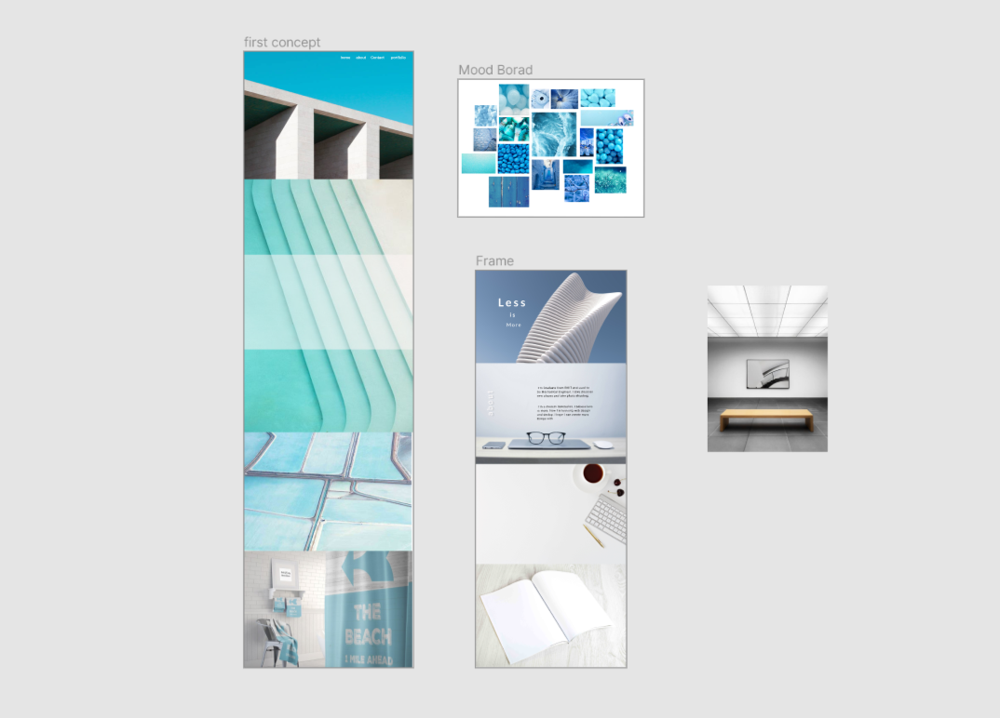
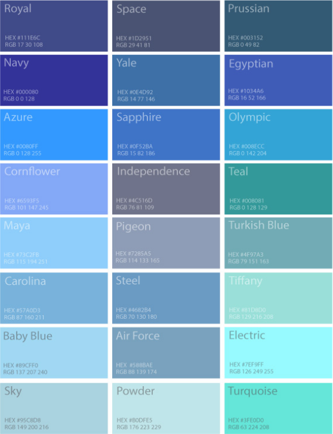
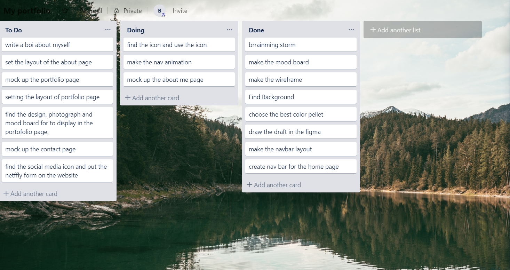

# portfolio

## website : https://brandonwebdesign.netlify.com/

## github : https://github.com/gjwtc3/portfolio

## Original concept 

 At first, I'm trying to do some blue theme portfolio in the  picture, which is the left one on the piture. also I spent my time on the color pair and color combiniation, personally I love blue, so I tried to find different blue color that works with each other. I use Azure , cornflower, maya and olympic to create a blue theme pellet, they looks nice, and then I 'm start to look after the background with the right color theme. blue is a cool color the one that pair with blue is red orange. 
 

## Challenge

When I originally trying to find the blue color, I found if there is only blue in my website, that would make the whole website mono color and very boring. And Just adding white font to blue background in every page come make enough contrast. Then I was thinking using some color pair rule, creating a orange color to pair with the blue to make more contrast, but it just not looks good to me. After I did rearch I think I need to add some black into my website. to enhance the contrasct , and also I need to use some texture to enrich the website and create more contrast too. this time I make the right decision, it looks all right to me now. and In the Css mock up, I also found a lot of chanllenge , the main challenge is the background picture I found is not fit properly in the css, because of the wrong height-width ratio, it either strectch out of the screen and a part of image is missing, or the width is not longer enought is cover the screen. I was trying to fixed with the background-attachement and background-size property, but for some reason it just not works as what I expected. I also tried to set margin to be a negaive value to make the offset, so the screen viewport can crop the background a little a bit and show me the exactly part that I really need. Also I If I can't find the right background, the layout won't works.

## Trello

I'm using trello for the in the duration of the project, it helps me to efficiently arrange my task, when I bring down the tasks into sections, I could able to know what I have done, what I need to do , and what i'm doing right now. 

## Things to improve

I'm still have a lot of thing to do on my projct, first , I want to use a overlay effect on my portfolio layout, also I'm going to add some css animation in the feature works page. 

